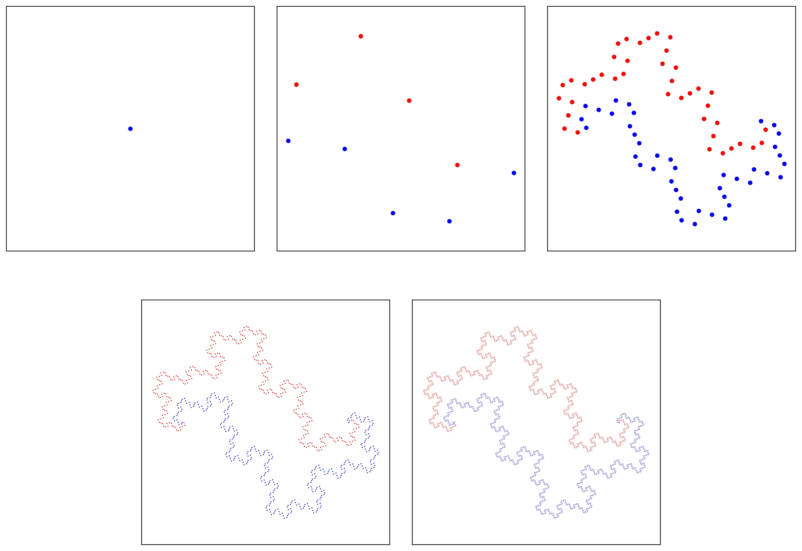

# FoldingCurves

A collection of tools for visualising & analysing folding curves.

This repository accompanies my Undergraduate Research Support Scheme (URSS) project titled “The Hausdorff dimension of the boundaries of self-avoiding plane-filling square-grid folding curves” conducted at the University of Warwick under the supervision of Dr Helena Verrill.

## Features

- **Jupyter notebook:** The main notebook `Boundaries of square-grid folding curves.ipynb` explains the underlying theory, new results, and demonstrates code implementation.
- **Python library (foldingcurves/):** Core functions to generate and analyze folding curves.
- **Output folder:** Contains generated images and data from analyses.
- **manim_dragon.py**: used manim to create paper folding animations (see [example](https://x.com/omfagbile/status/1979325997788156007)). See manim documentation for usage details.

## Nice pictures

